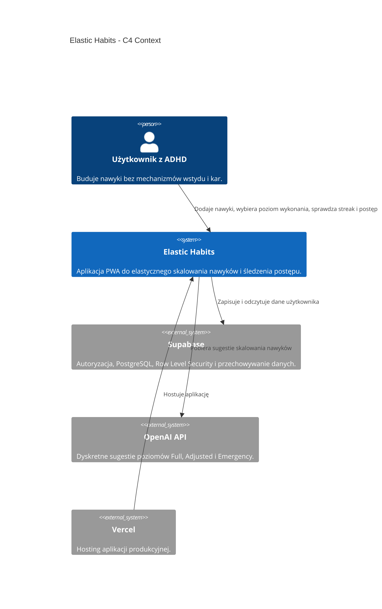

# C4 Context - Elastic Habits

## Cel diagramu
Ten dokument opisuje kontekst systemu Elastic Habits na poziomie C4 Context. Pokazuje głównych użytkowników, aplikację oraz zewnętrzne systemy, od których zależy produkt.

## Diagram

## Opis systemu
Elastic Habits jest aplikacją PWA opartą o Next.js i Supabase. Jej głównym zadaniem jest wspieranie użytkownika w utrzymaniu ciągłości nawyków bez nieusuwalnych resetów streaków i bez komunikatów wywołujących wstyd.

## Granice systemu
- Aplikacja odpowiada za interfejs, logikę nawyków, poziomy wykonania i komunikaty UX.
- Supabase odpowiada za autoryzację, bazę danych i polityki RLS.
- OpenAI API wspiera generowanie sugestii, ale aplikacja zachowuje fallback offline.
- Vercel odpowiada za publikację aplikacji.

## Powiązane dokumenty
- [ADR-001 stack](ADR-001_stack.md)
- [Decyzja stacku](../tech/stack_decision.md)
- [Wymagania biznesowe](../business/business_requirements.md)
